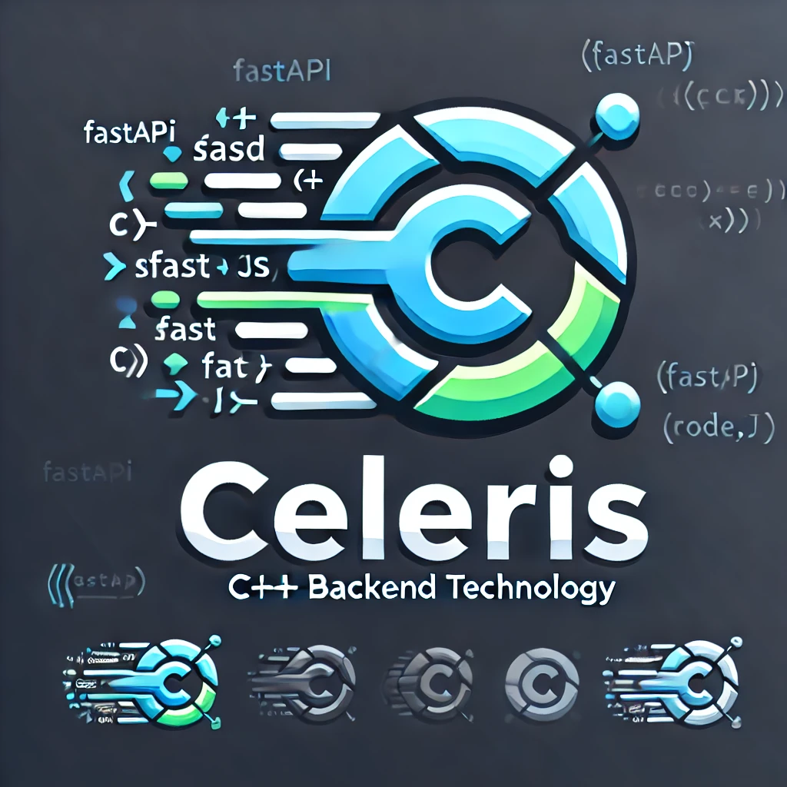

# Celeris



Celeris is a high-performance backend technology built with C++. Inspired by the meaning "fast" or "rapid" in Latin, Celeris is designed to provide developers with a modern and efficient way to build backend APIs, similar to popular frameworks like FastAPI or Node.js but with the power of C++.

## Features

- **High Performance:** Leveraging the speed of C++, Celeris provides fast and efficient API handling for high-demand applications.
- **Dynamic Routing:** Easily define routes for your application, supporting both GET and POST methods out of the box.
- **JSON Handling:** Built-in support for JSON serialization and deserialization using the nlohmann JSON library.
- **Extensible:** Modular design allowing easy addition of new features and extensions.

## Installation

To get started with Celeris, clone the repository and build the project:

```bash
git clone https://github.com/Alazar42/Celeris.git
cd Celeris
mkdir build && cd build
cmake ..
make
```

## Getting Started

Here's a basic example of setting up a simple server with Celeris:

```cpp
#include "celeris/celeris.hpp"
#include <nlohmann/json.hpp>

int main() {
    // Create a Celeris server instance
    Celeris app(8080);

    // Define a simple GET route
    app.get("/hello", [](const Request& req, Response& res) {
        nlohmann::json json_response = {{"message", "Hello, world!"}};
        res.set_json(json_response);
    });

    // Define a POST route
    app.post("/echo", [](const Request& req, Response& res) {
        nlohmann::json json_request = nlohmann::json::parse(req.body);
        res.set_json(json_request);
    });

    // Start the server
    app.listen();

    return 0;
}

```

## Documentation

For full documentation and advanced usage, please visit the [Celeris Documentation](https://github.com/Alazar42/Celeris/wiki).

## Contributing

Celeris is in active development, and contributions are welcome! To get started:

1. Fork the repository.
2. Create a new branch (`git checkout -b feature-branch`).
3. Make your changes.
4. Submit a pull request.

## License

Celeris is licensed under the GNU GENERAL PUBLIC LICENSE License. See the [LICENSE](LICENSE) file for more information.

## Contact

For questions, issues, or feature requests, please open an issue on GitHub or contact us at [alazartesfaye42@gmail.com](mailto:alazartesfaye42@gmail.com).
