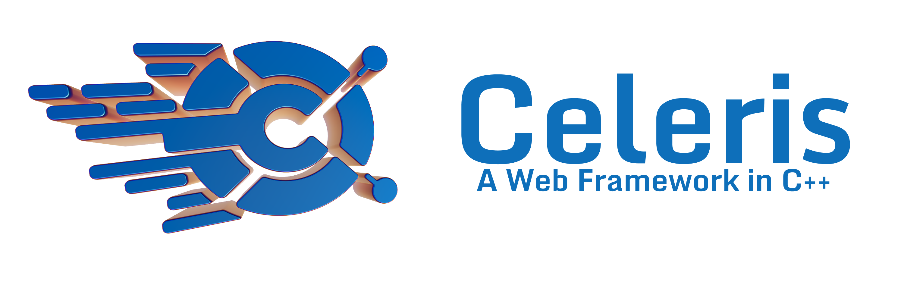

# Celeris



## **Overview**  
**Celeris** is a backend technology built with C++. Inspired by the Latin word for "fast" or "rapid," Celeris provides a modern and efficient way to build backend APIs. It combines the power and speed of C++ with a clean, developer-friendly API design, similar to popular frameworks like **FastAPI** or **Node.js**.

---

## **Features**  
- **High Performance**: Leverages C++’s speed for fast and efficient API handling, ideal for high-demand applications.  
- **Dynamic Routing**: Simple and flexible route definition with built-in support for GET and POST methods.  
- **JSON Handling**: Provides built-in serialization and deserialization of JSON using the **nlohmann JSON** library.  
- **Extensible**: Modular design allows easy addition of new features and extensions.

---

## **Installation**  
To get started with Celeris, follow these steps:

1. **Clone the Repository**:  
   ```bash
   git clone https://github.com/Alazar42/Celeris.git
   ```

2. **Build the Project**:  
   ```bash
   cd Celeris
   mkdir build && cd build
   cmake ..
   make
   ```

   Celeris comes with pre-included dependencies like Boost and nlohmann JSON, so there’s no need to install them separately.

---

## **Getting Started**  
Here’s a basic example to set up a simple server using Celeris:

```cpp
#include "celeris.hpp"

int main() {

    // Create a Celeris server instance
    Celeris app(8080);

    // Define a simple GET route for json response
    app.get("/hello", [](const Request& req, Response& res) {
        nlohmann::json json_response = {{"message", "Hello, world!"}};
        res.send(json_response.dump(), 200, JSON_TYPE);
    });

    // Define a simple GET route for HTML response
    app.get("/", [](const Request& req, Response& res) {
        std::string response = "<html><h1>Welcome To Celris Backend</h1></html>";
        res.send(response, 200, HTML_TYPE);
    });

    // Define a POST route for XML response
    app.post("/echo", [](const Request& req, Response& res) {
        res.send(req.body_, 200, XML_TYPE);
    });

    // Start the server
    app.listen();

    return 0;
}
```

**Explanation**:
- Creates a Celeris server instance on port **8080**.  
- Defines a simple GET route (`/hello`) that responds with a JSON message.  
- Defines a POST route (`/echo`) that echoes the received JSON request back in the response.  
- Starts the server and listens for incoming requests.

---

## **Contributing**  
Celeris is actively developed, and we encourage contributions! Here’s how you can contribute:

1. **Fork the Repository**.  
2. **Create a New Branch**:  
   ```bash
   git checkout -b feature-branch
   ```
3. **Make Your Changes**.  
4. **Submit a Pull Request** with a clear description of your changes.

### **Looking for Contributors**  
We’re seeking collaborators to help expand Celeris, particularly for adding:  
- **Database Integration** (preferably with ORM support)  
- **WebSocket Support**  

---

## **License**  
Celeris is licensed under the **GNU General Public License**. For more details, see the [LICENSE](https://github.com/Alazar42/Celeris/blob/main/LICENSE) file.

---

## **Contact**  
For questions, issues, or feature requests, please open an issue on [GitHub](https://github.com/Alazar42/Celeris.git) or contact us at [alazartesfaye42@gmail.com](mailto:alazartesfaye42@gmail.com).
